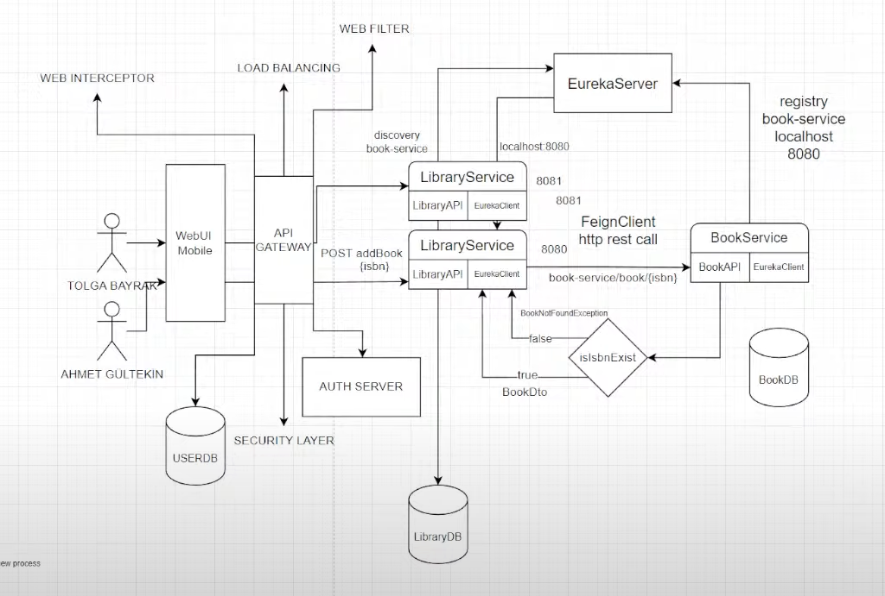

<h2 style="color:red"><b><i>Book Service API</h2>

```
main methodda 3 adet kayıt repository yoluyla veritabanına ekleniyor. 
Yani proje başlatılınca 3 kayıt mevcut.

Book book1 = new Book("Kitap1", 2013, "Yazar1", "PressName1", "Isbn1");
Book book2 = new Book("Kitap2", 2014, "Yazar2", "PressName2", "Isbn2");
Book book3 = new Book("Kitap3", 2015, "Yazar3", "PressName3", "Isbn3");

CONTROLLER PATH

[GetMapping] /book                  # getAllBook()
[GetMapping] /book/isbn/{isbn}      # getBookByIsbn(String isbn)
[GetMapping] /{id}                  # getBookById(String id)
```

<h2 style="color:red"><b><i>Library-Service API</h2>

```		
CONTROLLER PATH

[PutMapping] /library               # addBookToLibrary(AddBookRequestDto requestDto) 
[PostMapping] /library              # createLibrary()
[GetMapping] /library/{id}          # getLibraryById(String id)
```


<h2 style="color:red"><b><i>Bir servisi EurekaServer'a register etme</h2>

```
///
```

<h2 style="color:red"><b><i>Mikroservisler arası iletişim</h2>

```

@EnableEurekaClient Servisi eureka'ya register etmek için kullandığımız anotasyon.
@EnableFeignClient Register edilen servisi kullanmak için kullandığımız anotasyon.  bir mikro servisin başka bir mikro servisi çağırmak için kullanılan bir HTTP istemci kütüphanesidir.

EurekaServer, bizim mikroservisler arasındaki iletişimimizi sağlar. Bağımsız uygulamalar olduğu için birbirlerini tanımazlar. Biz tanıtırız. 
Bunu HTTP Rest api'ler ile gerçekleştirir. (GRPS ya da SOAP'ta olabilirdi.)
Arada REST API varsa genelde kullanılan 2 opsiyon var. Bunlar RestTemplate ve FeignClient 
Hangi servis verilerini expose edecekse onu Eureka'ya register etmeliyiz.
Bizim projede LibraryService, BookService'ye erişebilmeli ki id ile kitapları çekebilsin. Bundan dolayı BookService'yi register etmeliyiz.
BookService, LibraryService'ye ihtiyacı olmadığı için registere gerek yok.(erişmek derken istek atma durumu yok)

FeignClient anotasyonu ile herhangi bir arayüzü FeignClient'e çevirebiliriz.


LibraryService'de bir client tanımladım. 
mikroservisler spring.application.name ile Euroka'ya REGISTER olur.

@FeignClient(
    name = "book-service", # BookService'de application.properties'te tanımladığımız Register Name (spring.application.name)
    path = "/book") # BookService'nin api path'i olduğu için

# Burada kullanacağın metodları yaz sadece. 
public interface BookServiceClient {
    @GetMapping("/isbn/{isbn}")
    ResponseEntity<BookIdResponseDto> getBookByIsbn(@PathVariable String isbn);
}

Fault Tolerance
Biz normalde hata gönderiyoruz ya ExceptionMessage şeklinde, alınan hataya göre farklı bir process işlendiği olaya fault tolerance diyoruz.
Biz hata aldığımızda yeni bir process oluşturmak için 

        <dependency>
            <groupId>org.springframework.cloud</groupId>
            <artifactId>spring-cloud-circuitbreaker-resilience4j</artifactId>
        </dependency>
        
dependency'sini Library_Service'e ekledik
NOT: Bir projede mesela a servisi b servisinde hata fırlattırırken
b servisi a servisinde fault tolerance kullanabilir.

MethodNotAllowed(405) bir hatadır. Logger.error() çümkü kod içerisinde bir şey hatalı ama gelen parametreye istinaden hatalar
Logger info'dur
```


<h2 style="color:red"><b><i>Ders 4</h2>

```
Api Gateway
Bizim aşırı yük alan bir servisimizin sayısını 2 ye çıkartarak gelen istekleri bölüştürebiliriz fakat 2.servisin portu
farklı olacağı için bunu da ayarlamamız gerekiyor. Bunu ayarlaması için ApiGateway kullanacağız. 
ApiGateway, kendi içerisinde LoadBalancing bulunduruyor. (LibraryService'ler api gateway'a kayıtlı zaten)

Bu loadBalancing aşağıdaki işlemleri yapıyor aslında.
ApiGateway soruyor. Ben gelen isteği hangi LibraryService'e yönlendireyim ? 2 farklı instance var çünkü.
Şuan spring cloud gateway'de kullanılan RAUNTROWİNG algoritması ile buna karar verecek.
Server side load balancing 

Benim servislerimde security katmanı varsa tüm servislere yazmam gerekecek. Ama ApiGateway geliştirirsem tüm security
katmanını 1 yerde yazabilirim. SECURITY LAYER aslında burada olmalı
istek gelir. ApiGateway, bağlı olduğu Auth servisine gidip token'i kontrol eder ona göre işlem yapar

WEB FILTER'i apiGateway'e yüklerim. buna göre servislere aspect'ler yaratabiliriz. LibraryService'ye gelen istekte apiGateway'de kontrol edilir.
Aynı zamanda apiGateway'e INTERCEPTORLER yazabilirsin. Bu interceptor aracılığıyla mesela şunu diyebiliriz. Benim mikroservislerimden
herhangi birisine bir istekte bulunulması durumunda git httpRequest'e şunu ekle.

iyi dizayn edilmiş bir apiGateway yapısında Cache yapısı olmalı. Mesela basic Authentication işlemi yapsaydık sürekli DB'ye gidip kullanıcı kontrol etmesi
çok fazla gecikme yaşanacağı anlamına gelirdi. Yazacağımız apiGateway'i iyi tasarlamamız gerekiyor. Çok yük altında olması beklenemez çooook büyük proje olması gerek. 
Öyle bir durumda bunda da loadBalancer kurulabilir.

```



```
Api Gateway projesini yükleyip application.yml dosyası ile gerekli configurasyonları yaptığımızı varsayalım. 
Artık hem bu apiGateway üzerinden servisimize istek atabilirken aynı zamanda direkt olarak servisimize istek atabiliyoruz.
Biz sadece apiGateway üzerinden istek atmak istiyorsak servisleri dışarıya kapatmak gerekir.
Sabit bir ip vermezsem, ip'yi sadece bilenler bağlanır. Gerekli servislere random ip ataması yapmak için server.port: 0 yapıyoruz.
Ayrıca ben birden fazla LibraryService ayağa kaldırmak istiyorum. Bu her ayağa kalkan LibraryService aynı zamanda eurekaServer'a
register olsun istiyorum ki LoadBalancing yapabilelim.
LibraryService ---> application.properties ---> server.port: 0

Spring Actuator ile yeni bir uygulama da yazabilirsin. Bu sayede kendi template'ine göre detaylı bir uygulama sağlığı, durumu vs. görebilirsin.
Kıcasacı actuator ile bir dashboard tanımlayıp sistemin o anki durumunu izleyebileceğin bir yapı yapabilirsin.

Distributed Log Trace için ZIPKIN kullanacağız.
eskiden bir dependency'idi. Şimdi bir docker image
DistributedLog neden önemli ?
Biz libraryService'yi farklı konsollardan 2 instance olacak şekilde çalıştırdık.
Mikroservis projelerinde 10 adet mikro servisimiz olsa her birinin logu için o servise gitmemiz gerekecek.
Bize toplu bir log lazım. Zipkin dağıtık logları tek yere topluyor.

Zipkin'i docker image'ı olarak indirdik. Artık servislerimizi zipkin'e ekleyelim.

Authentication apiGateway'de olmalı. 
Ya da bir authorizationServer yazarsın. ApiGateway'i de interceptor olarak kullanırsın.

gRPS ?

spring cloud config neden gerkeiyor ?
200 adet servisin var diyelim. Bu 200 servis için hem application.properties hem de application-dev.properties
dosyası olsun diyelim. Bu durumda 200 x 2 = 400 adet dosyan olur. Bir düzenleme zamanı gelince ilgili servise gidip
güncellemem gerekecek. Bunun yerine tek bir repository'de toplasam ve yapılan değişiklikte tek bir merge request açsam
daha mantıklı olmaz mı ? 200 adet merge request yerine 1 tane yaparız ama 200 değişiklik olur.
İşte biz bundan dolayı spring cloud config'e ihtiyaç duyuyoruz. 

3 farklı spring cloud config tekniği var. 
- Classpath'tan config okumak
- git üzerinden konfigurasyon
- (Hatırlamıyorum :D )

Direkt git üzerinden bir repository de oluşturabilirsin ya da projenin repository'sini de kullanabilirsin.
Hangisi best practice tartışılır
 
Bu değerler şu anda config server içerisinde
Mikroservislerin şuan erişimi yok. 
http://localhost:8888/library-service/default
http://localhost:8888/library-service/dev

ilgili mikroservis bu conf'ları alabilmesi için pom.xml'ine dependency ekleyeceğiz.
spring-cloud-starter-config

Bunu ekledikten sonra artık spring-cloud-starter-config configurasyonları yapabilirim application.properties'te
spring-cloud-config-uri=optional:configserver:http://localhost:8888/ # sonuna / koymazsan hata verir.
ayrıca biz sonuna library-service/dev felan eklemiyoruz. Bunu dinamik olarak alıyor. application-name + profile şeklinde.
application-name değiştirirsen conf'ların adını da değişmen gerekir.

burada optional dememizin nedeni resiliance diyoruz ya uygulama hiç çökmesin dirençli uygulama olmasını istediğimiz için.


```

